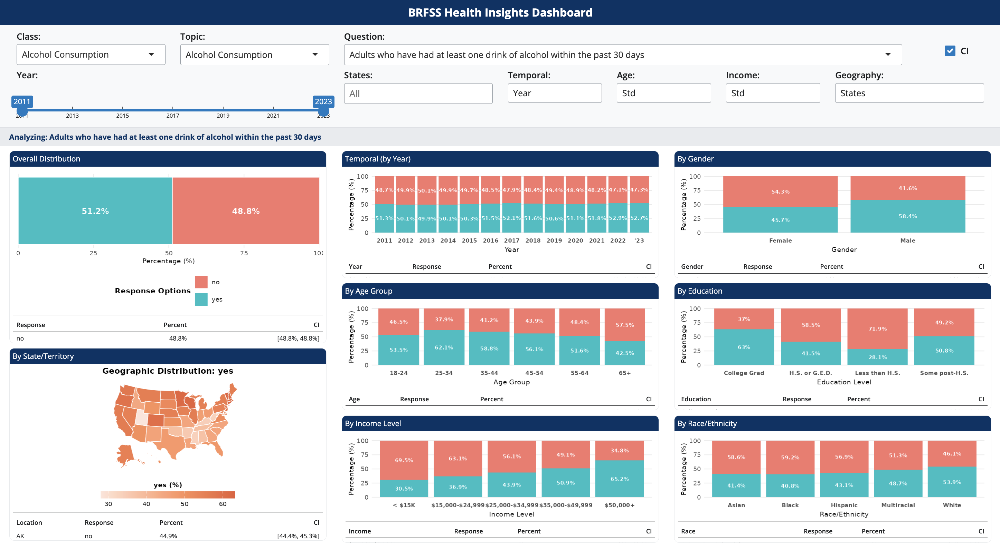

# BRFSS Health Insights Dashboard

<div align="center">

[](https://tanishbhilare.shinyapps.io/BRFSS-health-dashboard/)
[](https://www.r-project.org/)
[](https://shiny.rstudio.com/)

**An interactive R Shiny dashboard for visualizing CDC BRFSS health data across multiple demographic dimensions**

[Features](#features) • [Demo](#live-demo) • [Installation](#installation) • [Technologies](#technologies) • [Architecture](#architecture)



</div>

---

## Overview

The **BRFSS Health Insights Dashboard** is a comprehensive data visualization tool that enables exploration of the Behavioral Risk Factor Surveillance System (BRFSS) dataset from the Centers for Disease Control and Prevention (CDC). This interactive dashboard provides insights into health trends across demographics, geography, and time.

### Key Highlights

- **2.76M+ data points** spanning 2011-2023
- **55 states/territories** with interactive mapping
- **8 visualization panels** for multi-dimensional analysis
- **Real-time filtering** with optimized performance
- **Statistical rigor** with 95% confidence intervals

---

## Features

### Multi-Dimensional Analysis

<table>
<tr>
<td width="50%">

**Geographic Analysis**
- Interactive US state map
- Regional aggregation (Northeast, South, Midwest, West)
- State-by-state comparisons

**Temporal Trends**
- Year-by-year analysis (2011-2023)
- 3-year period aggregation option
- Trend identification over time

</td>
<td width="50%">

**Demographic Breakdowns**
- Age groups (6 standard or 3 simplified)
- Gender distribution
- Race/Ethnicity categories
- Education levels
- Income brackets (6 standard or 3 simplified)

</td>
</tr>
</table>

### Interactive Features

| Feature | Description |
|---------|-------------|
| **Dynamic Filtering** | Filter by Class, Topic, Question, Year Range, and States |
| **Click-to-Enlarge** | Click any visualization for a detailed modal view |
| **Confidence Intervals** | Toggle 95% CI tables on/off for statistical validation |
| **Flexible Aggregation** | Switch between detailed and simplified demographic groupings |
| **Smart Caching** | Optimized performance with reactive expression caching |
| **Interactive Maps** | Explore geographic patterns with color-coded state maps |

### Performance Optimizations
```
Original Dataset: 569 MB in memory
         ↓
Pre-processing Pipeline
         ↓
Optimized Dataset: 168 MB (70% reduction)
```

- Pre-processed data with all transformations applied
- Parquet format for fast loading (~1 second)
- GZIP level 9 compression
- Strategic column selection
- Pre-aggregated duplicates

---

## Live Demo

**[Access the Live Dashboard Here](https://tanishbhilare.shinyapps.io/BRFSS-health-dashboard/)**

### Sample Use Cases

1. **Compare obesity rates** across income levels and states
2. **Analyze smoking trends** over the past decade
3. **Explore health insurance coverage** by demographic groups
4. **Identify regional health disparities** across the United States

---

## Technologies

<div align="center">

| Technology | Purpose |
|------------|---------|
|  | Core programming language |
|  | Interactive web framework |
|  | Data manipulation |
|  | Data visualization |
|  | High-performance data format |
|  | Modern Bootstrap UI |
|  | US state mapping |

</div>

---

## Project Structure
```
brfss-dashboard/
│
├── app.r                          # Main Shiny application
├── load_data.r                    # Data loading module  
├── brfss_data_optimized.parquet   # Pre-processed data (168 MB)
├── layerQ_optimized.parquet       # Question hierarchy
├── justQ_optimized.parquet        # Question list
├── README.md                      # Project documentation
├── .gitignore                     # Git ignore rules
└── screenshot.png                 # Dashboard preview
```

> **Note:** Data files (`.parquet`) are excluded from the repository due to size. See [Installation](#installation) for setup instructions.

---

## Installation

### Prerequisites

- **R** (≥ 4.0) - [Download here](https://www.r-project.org/)
- **RStudio** (recommended) - [Download here](https://posit.co/download/rstudio-desktop/)

### Local Setup

**Step 1: Clone the repository**
```bash
git clone https://github.com/Tashbhilare/brfss-dashboard.git
cd brfss-dashboard
```

**Step 2: Install required R packages**
```r
# Install all dependencies
install.packages(c(
  "shiny",      # Web framework
  "bslib",      # UI components
  "tidyverse",  # Data manipulation
  "ggplot2",    # Visualization
  "memoise",    # Caching
  "usmap",      # US mapping
  "arrow"       # Parquet support
))
```

**Step 3: Obtain the data**

Download the BRFSS Prevalence Data from the [CDC Data Portal](https://data.cdc.gov/Behavioral-Risk-Factors/Behavioral-Risk-Factor-Surveillance-System-BRFSS-P/dttw-5yxu)

Contact me for preprocessing scripts to create the optimized `.parquet` files.

**Step 4: Run the application**
```r
# In R console
shiny::runApp()

# Or in RStudio, open app.r and click "Run App"
```

The dashboard will open in your default web browser.

---

## Data Source

<div align="center">

### Behavioral Risk Factor Surveillance System (BRFSS)

*The nation's premier system of health-related telephone surveys*

</div>

| Attribute | Details |
|-----------|---------|
| **Source** | Centers for Disease Control and Prevention (CDC) |
| **Time Period** | 2011-2023 (13 years) |
| **Coverage** | All 50 U.S. states + territories |
| **Total Records** | 2,763,102 → 2,448,945 (aggregated) |
| **Questions** | 99 unique health topics |
| **Format** | Optimized Parquet files with GZIP compression |

The BRFSS collects state data about U.S. residents regarding their health-related risk behaviors, chronic health conditions, and use of preventive services.

[Learn more about BRFSS](https://www.cdc.gov/brfss/index.html)

---

## Architecture

### Data Processing Pipeline
```
Raw CDC Data (CSV, 1.5GB)
         ↓
Preprocessing (Local Machine)
         ↓
Apply ID Merges
         ↓
Aggregate Duplicate Records
         ↓
Column Selection
         ↓
Optimized Parquet (17.5 MB)
         ↓
Cloud Deployment (shinyapps.io)
         ↓
Fast Loading (168 MB memory)
```

### Key Optimizations

| Optimization | Impact |
|--------------|--------|
| **Pre-aggregation** | Reduced rows by 11.4% |
| **Column Selection** | Kept only 9 essential columns |
| **GZIP Compression** | File size: 20.17 MB → 17.52 MB |
| **Memory Efficiency** | Runtime usage: 569 MB → 168 MB |
| **Reactive Caching** | Instant plot updates on filter changes |

---

## Performance Metrics

<div align="center">

| Metric | Value |
|--------|-------|
| **Initial Load Time** | ~1 second |
| **Memory Usage** | 168 MB |
| **Data Points** | 2.45M (aggregated) |
| **Questions Available** | 99 topics |
| **Geographic Coverage** | 55 states/territories |
| **Time Range** | 2011-2023 (13 years) |
| **File Size** | 17.5 MB (compressed) |

</div>

---

## Use Cases

### Public Health Research
Analyze population health trends, risk factors, and preventive service utilization across different demographic groups.

### Policy Analysis
Compare health outcomes by state and region to inform evidence-based policy decisions.

### Health Education
Visual exploration of health behaviors and chronic conditions for educational purposes.

### Data Science Portfolio
Demonstrate expertise in:
- Interactive dashboard development
- Large dataset optimization
- Statistical visualization
- Cloud deployment

---

## Contributing

Contributions, issues, and feature requests are welcome!

1. Fork the repository
2. Create your feature branch (`git checkout -b feature/AmazingFeature`)
3. Commit your changes (`git commit -m 'Add some AmazingFeature'`)
4. Push to the branch (`git push origin feature/AmazingFeature`)
5. Open a Pull Request

---

## Author

<div align="center">

### Tanish Bhilare

[](https://github.com/Tashbhilare)

</div>

---

